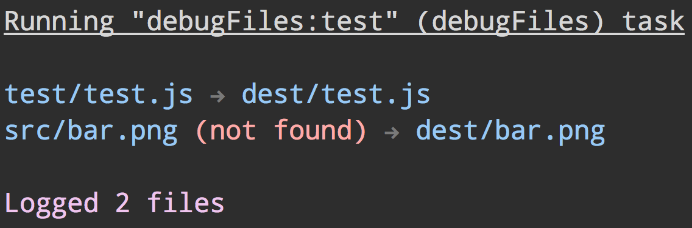

# grunt-debug-files

> Debug files run through grunt



Useful for checking what files matched the glob or make sure all files exist.


## Install

```
$ npm install --save-dev grunt-debug-files
```


## Usage

Just replace the task name of the task you want to debug with `debugFiles` or add a new task with the same `files` object.

```diff
 require('load-grunt-tasks')(grunt);

 grunt.initConfig({
-	existingTask: {
+	debugFiles: {
 		dist: {
 			files: {
 				'dist/main.js': 'src/main.js'
 			}
 		}
 	}
 });

-grunt.registerTask('default', ['existingTask']);
+grunt.registerTask('default', ['debugFiles']);
```


## License

MIT © [Sindre Sorhus](https://sindresorhus.com)
